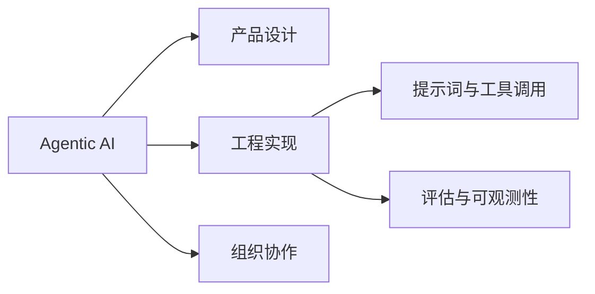

# 阅读地图

阅读地图用来回答一个问题：这些书之间是什么关系？

## 当前主题

## 知识线索

| 线索 | 关注问题 | 相关笔记 |
| --- | --- | --- |
| Agent 工作流 | 如何把开放任务拆成可验证步骤 | [Agentic AI 学习](books/agentic-ai/index.md) |
| 读书方法 | 如何从摘抄转向复盘和行动 | [笔记系统](methods/note-system.md) |

